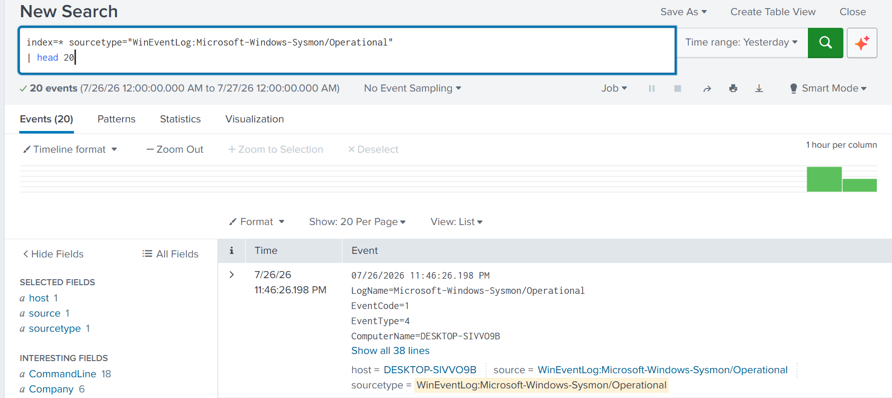
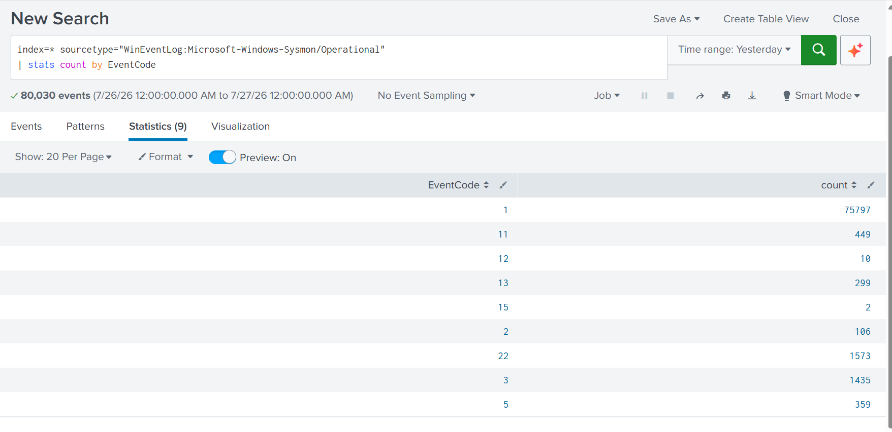
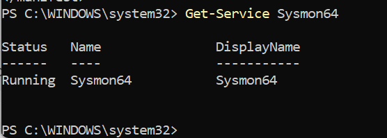
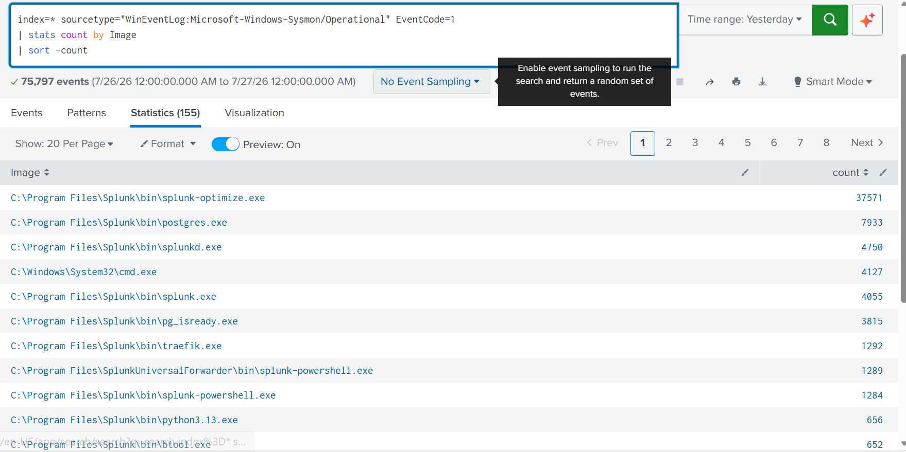

# Lab Setup & Verification

## Objective

Before simulating the phishing attack, the monitoring
infrastructure was validated to ensure endpoint telemetry,
Sysmon logs, and Splunk data ingestion were functioning
correctly.

This verification established a reliable baseline, ensuring
that all attacker activity could be captured and correlated
throughout the investigation.

---

## Verification Evidence

### Splunk Sysmon Event Overview

This dashboard confirms that Sysmon events are being
successfully collected and indexed by Splunk, providing
visibility into endpoint activity before the attack begins.

---

### Splunk Sysmon Event Code Distribution

The Event Code distribution validates that multiple Sysmon
event types are being ingested, confirming broad endpoint
telemetry coverage for the investigation.

---

### Sysmon Service Status Verification

The Sysmon service was verified to be running successfully on
the monitored endpoint, ensuring continuous generation of
endpoint telemetry throughout the attack simulation.

---

### Splunk Top Executed Processes (Event ID 1)

Splunk analysis of Sysmon Event ID 1 confirms successful
collection of process creation events, providing visibility
into process execution that is essential for detecting
malicious activity during later investigation phases.

---

## Outcome

The monitoring infrastructure was successfully validated
prior to the simulated phishing attack.

Verification confirmed that:

- Sysmon was installed and actively collecting endpoint events.
- Splunk was successfully ingesting Sysmon telemetry.
- Event code distribution demonstrated complete log visibility.
- Process creation events (Sysmon Event ID 1) were available
  for threat hunting and forensic analysis.

With endpoint telemetry and SIEM visibility confirmed, the
environment was ready for the enterprise phishing incident
simulation.
