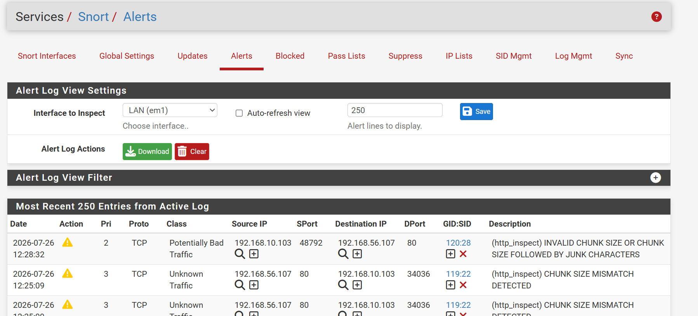

# Exploitation

## Overview

The Exploitation phase represents the point at which the
attacker actively targeted vulnerable services after obtaining
initial access to the NAD Cybersecurity Institute environment.

Following successful credential compromise, the attacker
interacted with both the public-facing web application and the
SSH service. Security monitoring platforms generated endpoint
and network alerts that enabled the Security Operations Center
(SOC) to reconstruct the attack and validate exploitation
activity.

This investigation combines Wazuh endpoint detections with
Snort IDS network alerts to provide complete visibility into
the exploitation phase.

---

# Objectives

- Detect exploitation attempts against exposed services.
- Investigate SQL injection activity targeting the web application.
- Analyze SSH authentication events.
- Correlate successful and failed login attempts.
- Validate detections across endpoint and network monitoring platforms.

---

# Business Scenario

After successfully compromising user credentials through the
phishing campaign, the attacker attempted to exploit services
available within the organization's infrastructure.

The attacker targeted the vulnerable web application using
SQLMap while simultaneously attempting to gain remote access
through SSH. Multiple security controls generated alerts that
allowed analysts to investigate authentication events,
application attacks, and network traffic associated with the
intrusion.

---

# Tools Used

- Wazuh SIEM
- Snort IDS
- Sysmon
- Kali Linux

---

# MITRE ATT&CK Mapping

| Tactic | Technique | ID |
|---------|-----------|------|
| Execution | Command and Scripting Interpreter | T1059 |
| Credential Access | Brute Force | T1110 |
| Initial Access | External Remote Services | T1133 |
| Exploitation | Exploit Public-Facing Application | T1190 |

---

# Investigation Workflow

1. Review Wazuh alerts for web attack activity.
2. Investigate SQLMap detections.
3. Analyze SSH authentication events.
4. Review brute-force login attempts.
5. Correlate successful SSH authentication.
6. Validate Wazuh detection rules.
7. Review Snort IDS network alerts.

---

# Evidence

## SQLMap Web Application Attack

Wazuh successfully detected SQLMap activity targeting the
vulnerable web application.

### SQLMap Web Attack Detection

Initial Wazuh alert identifying SQLMap activity against the
public-facing web application.

---

### SQLMap Event Details

Detailed event information including rule metadata, source
information, and captured log data.

---

### SQLMap Search Results

Search results confirming multiple SQLMap-related events
captured during exploitation.

---

### SQLMap Document Details

Complete document information providing additional forensic
context for the detected SQL injection activity.

---

# SSH Authentication Investigation

Following the web attack, the attacker targeted the SSH
service to obtain remote access.

### Successful SSH Authentication

Wazuh detected a successful SSH login, confirming that valid
credentials were used to authenticate to the target system.

---

### SSH Brute-Force Activity

Multiple failed authentication attempts indicate a brute-force
attack against the exposed SSH service.

---

### Repeated SSH Login Failures

The event timeline illustrates repeated authentication
failures prior to successful access.

---

### Wazuh Rule 5760

Rule **5760** was triggered after repeated failed SSH
authentication attempts, identifying suspicious login
behavior.

---

### Wazuh Rule 5715

Rule **5715** confirmed successful SSH authentication,
indicating that the attacker ultimately gained remote access
to the system.

---

# Snort IDS Detection

While Wazuh provided endpoint visibility, Snort IDS monitored
network traffic generated during the exploitation phase.

### HTTP Inspect Alert

Snort's HTTP Inspect preprocessor generated an alert after
detecting suspicious HTTP traffic associated with exploitation
attempts against the target web application.

---

# Findings

The investigation confirmed active exploitation of services
exposed within the target environment.

Evidence demonstrated:

- SQLMap exploitation targeting the web application.
- Multiple SSH authentication attempts.
- Brute-force behavior preceding compromise.
- Successful SSH authentication.
- Endpoint detections generated by Wazuh.
- Network-based detection by Snort IDS.

By correlating endpoint telemetry with network monitoring,
analysts reconstructed the complete exploitation timeline with
high confidence.

---

# Detection Summary

| Platform | Detection |
|----------|-----------|
| Wazuh | SQLMap web attack detected |
| Wazuh | SSH brute-force detected |
| Wazuh | Successful SSH authentication confirmed |
| Snort IDS | Suspicious HTTP activity detected |

---

# Lessons Learned

The Exploitation phase demonstrates the importance of layered
security monitoring.

Wazuh provided detailed endpoint visibility into web
application attacks and authentication events, while Snort IDS
captured suspicious network traffic generated during
exploitation.

Correlating endpoint telemetry with network alerts enabled the
Security Operations Center to rapidly validate attacker
activity, accurately reconstruct the exploitation timeline,
and strengthen confidence in the investigation findings.
