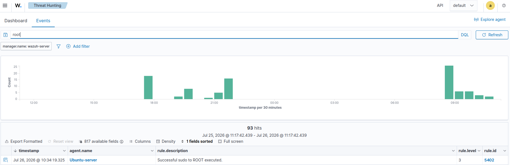
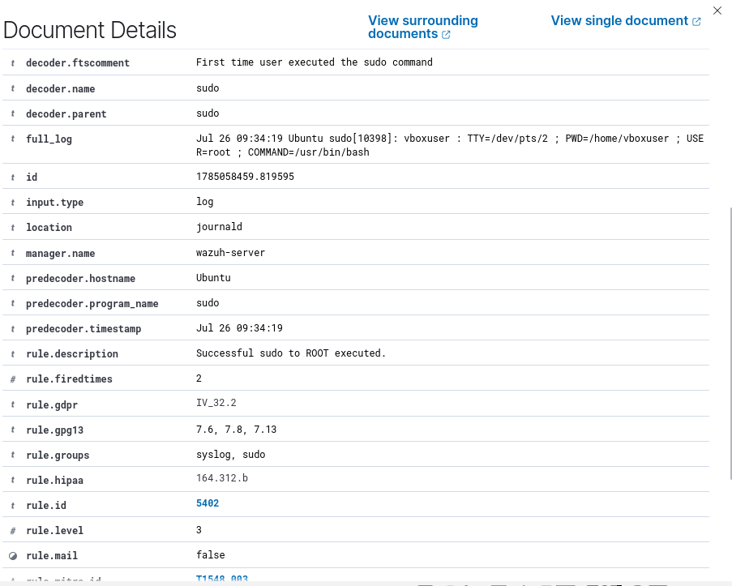
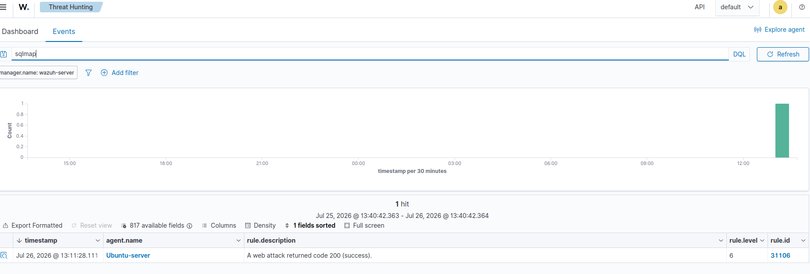
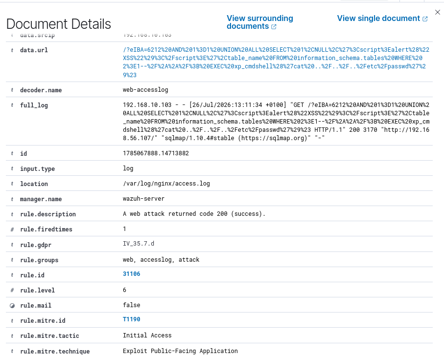
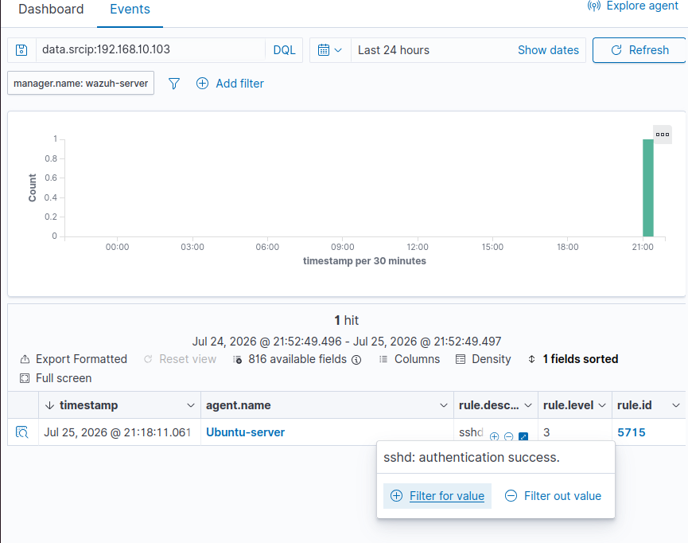
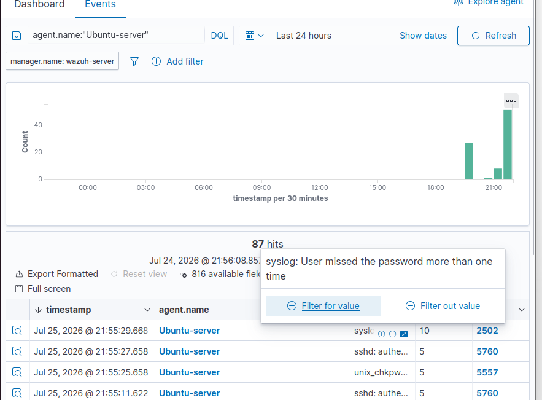
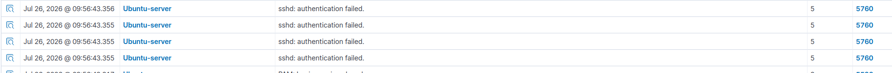
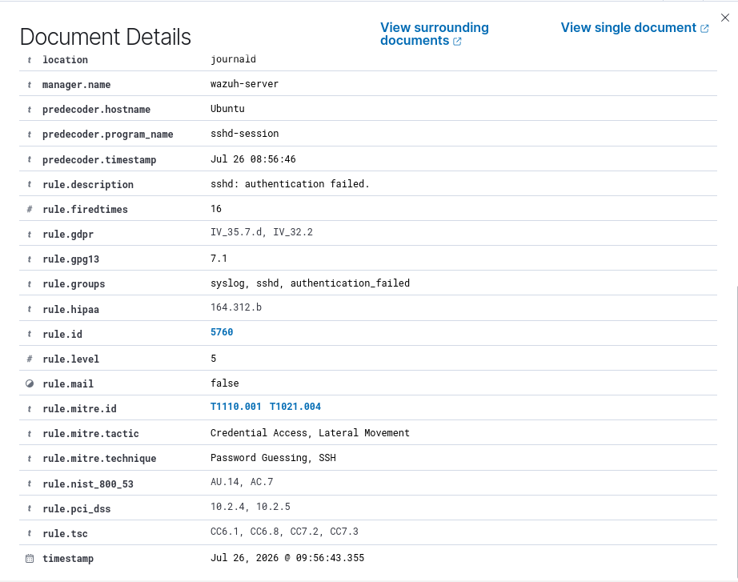
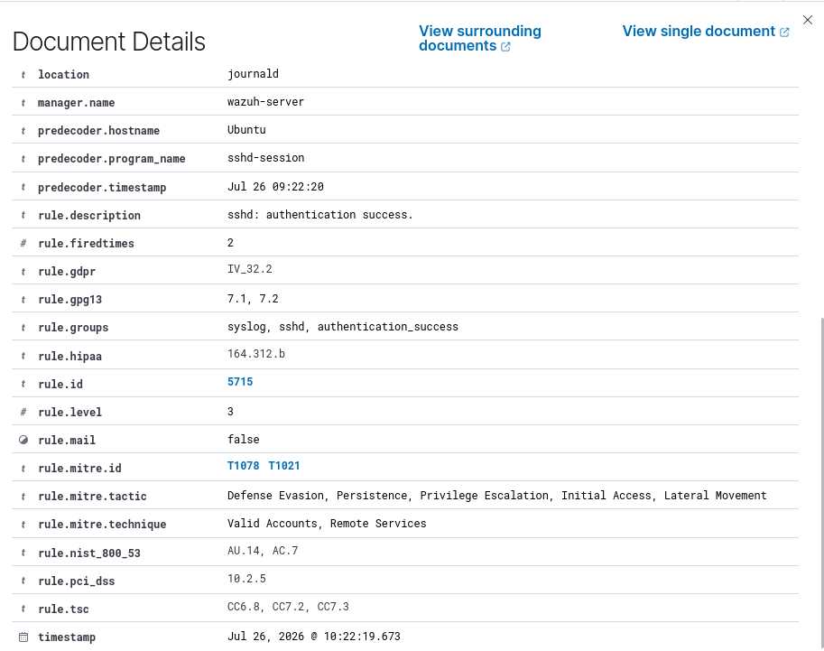

# Exploitation

## Overview

The Exploitation phase represents the point at which the attacker attempts to execute malicious actions against vulnerable services after obtaining initial access.

Following successful credential compromise, the attacker interacted with exposed services within the NAD Cybersecurity Institute environment. Security monitoring platforms detected both web application attack activity and SSH authentication events, allowing the Security Operations Center (SOC) to reconstruct the exploitation phase using endpoint and network telemetry.

This investigation combines Wazuh endpoint detections with Snort IDS network alerts to validate exploitation attempts against the target environment.

---

# Objectives

- Detect exploitation attempts against exposed services.
- Investigate web application attack activity.
- Analyze SSH authentication events.
- Correlate successful and failed login attempts.
- Validate detections across endpoint and network monitoring platforms.

---

# Business Scenario

After gaining initial access through a phishing campaign, the attacker attempted to exploit services exposed within the organization's infrastructure.

During this phase, the attacker interacted with the target web application and SSH service. Multiple security controls generated alerts that enabled analysts to investigate authentication events, web attack activity, and network traffic associated with the intrusion.

---

# Tools Used

- Wazuh SIEM
- Snort IDS
- Sysmon
- Kali Linux

---

# MITRE ATT&CK Mapping

| Tactic | Technique | ID |
|---------|-----------|------|
| Execution | Command and Scripting Interpreter | T1059 |
| Credential Access | Brute Force | T1110 |
| Initial Access | External Remote Services (SSH) | T1133 |
| Exploitation | Exploit Public-Facing Application | T1190 |

---

# Investigation Workflow

1. Review Wazuh alerts for web attack activity.
2. Investigate SQLMap detection events.
3. Analyze successful SSH authentication events.
4. Review brute-force login attempts.
5. Investigate repeated failed SSH logins.
6. Validate detection rules triggered by Wazuh.
7. Correlate network activity using Snort IDS.

---

# Evidence

## Wazuh Detection

Wazuh successfully detected exploitation activity targeting
both the vulnerable web application and the exposed SSH
service. The alerts provided visibility into SQL injection
attempts and unauthorized authentication activity throughout
the attack.

---

## SQLMap Detection

### SQLMap Web Attack Detection

Wazuh generated an alert identifying SQLMap activity targeting
the vulnerable web application, indicating an active SQL
injection attempt.

---

### SQLMap Event Details

Detailed event information captured by Wazuh, including rule
information, source details, and log data associated with the
SQLMap attack.

---

### SQLMap Search Results

Search results confirming multiple SQLMap-related events,
allowing investigators to correlate exploitation activity
across the attack timeline.

---

### SQLMap Document Details

Complete event metadata providing additional forensic details,
including timestamps, rule matches, and log information for
the detected SQL injection attack.

---

## SSH Authentication Investigation

Following the web exploitation attempt, Wazuh detected
multiple SSH authentication events, including brute-force
activity and a successful compromise.

---

### Successful SSH Login

Wazuh detected a successful SSH authentication event,
indicating that the attacker successfully accessed the target
system using valid credentials.

---

### SSH Brute-Force Attempts

Multiple failed SSH authentication attempts were detected,
indicating an active brute-force attack against the exposed
SSH service.

---

### Repeated SSH Login Failures

The event timeline shows repeated authentication failures,
providing evidence of sustained password guessing attempts.

---

### Wazuh Rule 5760 - Failed SSH Login

Rule **5760** was triggered after detecting failed SSH
authentication attempts, highlighting suspicious login
behavior requiring investigation.

---

### Wazuh Rule 5715 - Successful SSH Login

Rule **5715** confirmed a successful SSH login following the
authentication attempts, demonstrating that the attacker
ultimately obtained access to the target system.
- Rule 5715 confirming successful SSH authentication following credential compromise.

---

## Snort IDS Detection

Network-based monitoring detected suspicious HTTP traffic generated during exploitation.

### Evidence

**05_Snort_HTTP_Inspect_Alert_Log.png**

- Snort HTTP Inspect preprocessor alert capturing suspicious HTTP activity associated with exploitation attempts.

---

# Findings

The investigation confirmed active exploitation of services exposed by the target environment.

Evidence demonstrated:

- SQLMap web attack activity.
- Multiple SSH authentication attempts.
- Brute-force behavior.
- Successful SSH authentication.
- Detection by Wazuh.
- Network visibility provided by Snort IDS.

The combination of endpoint telemetry and network monitoring provided high-confidence evidence of exploitation activity.

---

# Detection Summary

| Platform | Result |
|----------|--------|
| Wazuh | SQLMap attack detected |
| Wazuh | SSH brute-force detected |
| Wazuh | Successful SSH login confirmed |
| Snort IDS | Suspicious HTTP activity detected |

---

# Lessons Learned

The Exploitation phase demonstrated the value of layered detection capabilities.

Wazuh provided detailed endpoint visibility into authentication events and web application attacks, while Snort IDS detected suspicious network traffic associated with exploitation attempts. Correlating endpoint and network telemetry enabled analysts to rapidly validate attacker activity and accurately reconstruct the exploitation timeline.
