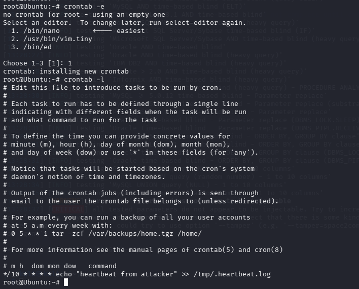
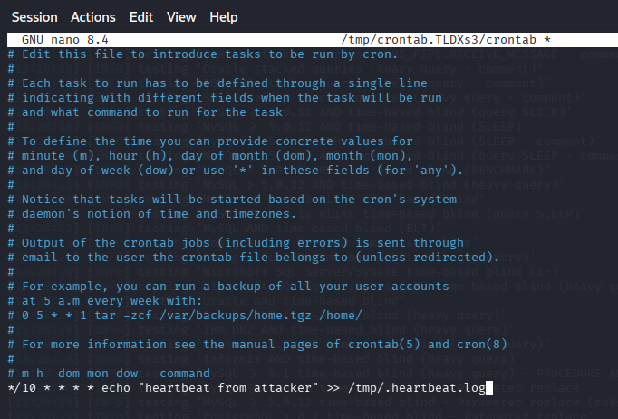
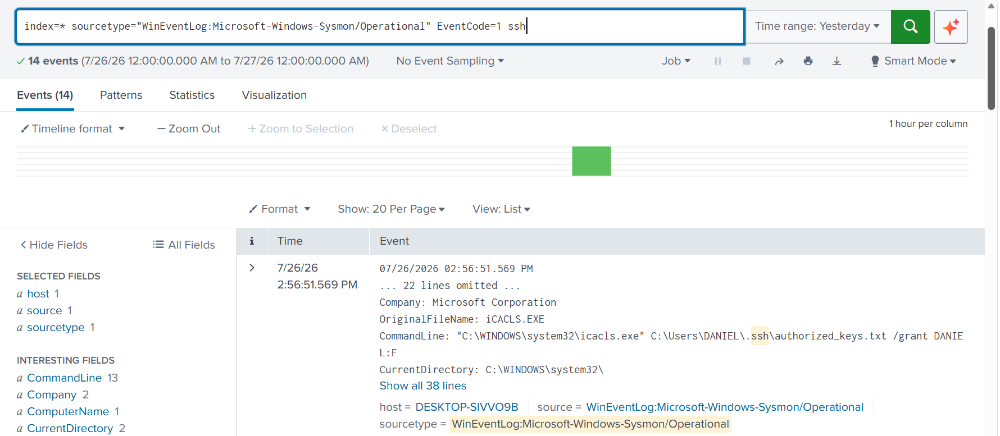
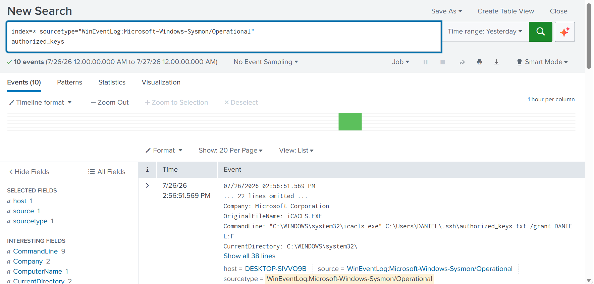
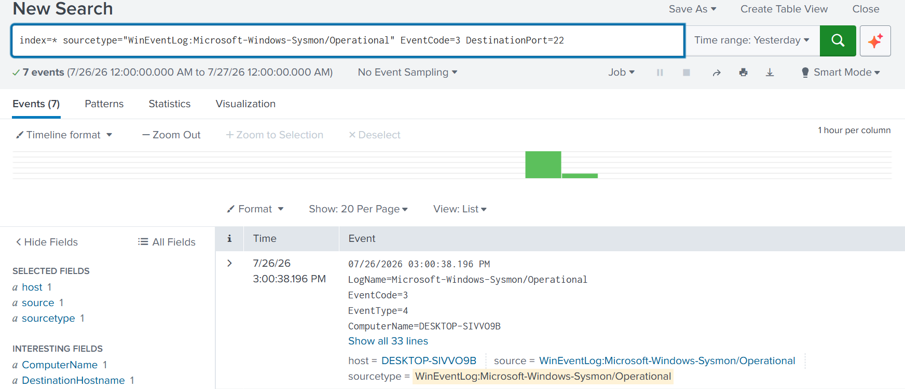

# Persistence

## Overview

Persistence enables an attacker to maintain long-term access to a compromised system even after reboots, user logouts, or password changes.

In this simulated incident involving the NAD Cybersecurity Institute, the attacker established multiple persistence mechanisms after obtaining root privileges. These included creating a cron-based backdoor and installing a malicious SSH authorized key to enable passwordless remote access.

The Security Operations Center (SOC) investigated these persistence mechanisms using Linux command-line evidence and correlated them with Splunk telemetry.

---

# Objectives

- Identify persistence mechanisms established by the attacker.
- Investigate cron-based scheduled task persistence.
- Detect SSH authorized_keys modification.
- Validate persistence through Splunk investigations.
- Understand attacker techniques used to maintain long-term access.

---

# Business Scenario

After successfully escalating privileges, the attacker sought to maintain continuous access to the compromised Linux server.

To achieve persistence, a malicious cron job was created that executed automatically at scheduled intervals. Additionally, the attacker implanted a rogue SSH public key into the victim's **authorized_keys** file, enabling passwordless remote access without requiring user credentials.

These persistence mechanisms would allow the attacker to regain access even if passwords were changed.

---

# Tools Used

- Kali Linux
- Linux Cron
- SSH
- Splunk Enterprise

---

# MITRE ATT&CK Mapping

| Tactic | Technique | ID |
|---------|-----------|------|
| Persistence | Scheduled Task / Cron | T1053.003 |
| Persistence | SSH Authorized Keys | T1098.004 |
| Persistence | Account Manipulation | T1098 |

---

# Investigation Workflow

1. Create cron-based persistence.
2. Implant malicious SSH authorized key.
3. Investigate SSH authorized_keys activity.
4. Validate file access events.
5. Review network connections over SSH.
6. Correlate evidence within Splunk.

---

# Evidence

## Scheduled Task Persistence

To maintain long-term access, the attacker established
persistence by creating a malicious cron job configured to
execute automatically at scheduled intervals.

### Cron Persistence Backdoor

The attacker created a malicious cron job that executes
automatically, providing persistent access to the compromised
system even after user logoff or system reboot.

---

# SSH Persistence

Following successful privilege escalation, the attacker
established an additional persistence mechanism by implanting
a malicious SSH public key into the **authorized_keys** file.
This enabled passwordless remote authentication while reducing
the likelihood of detection.

### Authorized Keys Backdoor

A malicious SSH public key was added to the
**authorized_keys** file, allowing the attacker to reconnect
to the system without requiring user credentials.

---

### Splunk Authorized Keys Investigation

Splunk telemetry captured activity involving the
**authorized_keys** file, enabling analysts to correlate file
modification events with the persistence phase of the attack.

---

### Authorized Keys File Access

Forensic evidence confirms that the **authorized_keys** file
was accessed and modified, validating the attacker's
persistence mechanism.

---

### SSH Network Connections (Port 22)

Splunk analysis of network connections over **TCP port 22**
shows continued SSH communication associated with the
persistent backdoor, providing additional evidence of
maintained remote access.
- Splunk investigation showing SSH communication over TCP port 22 associated with persistent remote access.

---

# Findings

The investigation confirmed that the attacker established multiple persistence mechanisms after obtaining administrative privileges.

Evidence demonstrated:

- Creation of a cron-based scheduled task.
- Installation of a rogue SSH authorized key.
- Modification of the authorized_keys file.
- Continued SSH connectivity over port 22.
- Successful persistence without requiring password authentication.

These techniques would allow the attacker to regain access even after user password resets or system restarts.

---

# Detection Summary

| Platform | Result |
|----------|--------|
| Kali Linux | Cron persistence established |
| Kali Linux | SSH authorized_keys backdoor created |
| Splunk | Authorized_keys activity detected |
| Splunk | File access confirmed |
| Splunk | SSH network connections validated |

---

# Lessons Learned

Persistence mechanisms often remain unnoticed after an attacker has achieved elevated privileges. Monitoring scheduled tasks, cron jobs, SSH configuration files, and authentication-related artifacts enables defenders to detect unauthorized persistence before attackers can re-establish access.

Routine auditing of cron configurations, SSH authorized_keys files, and privileged account changes should be incorporated into Linux security monitoring programs.
