# Discovery

## Overview

The Discovery phase represents the attacker's effort to
understand the compromised environment before pursuing
additional objectives. During this stage, the attacker
enumerated the operating system, identified users and network
configuration, searched for sensitive files, collected
valuable data, and investigated infrastructure associated
with the phishing campaign.

The Security Operations Center (SOC) correlated Linux command
history, Splunk telemetry, and Open Source Intelligence
(OSINT) to reconstruct the attacker's discovery activities
and determine the scope of the compromise.

---

# Objectives

- Identify sensitive information collected by the attacker.
- Investigate file and directory enumeration.
- Analyze post-exploitation discovery commands.
- Detect discovery activity using Splunk Enterprise.
- Enrich indicators of compromise with OSINT.
- Correlate attacker behavior with MITRE ATT&CK techniques.

---

# Business Scenario

After successfully establishing persistence and evading
security controls, the attacker began surveying the
compromised Linux server to understand its environment and
identify valuable information.

The attacker enumerated system configuration, users, network
interfaces, directories, and sensitive files before archiving
collected data for potential exfiltration. At the same time,
SOC analysts enriched indicators of compromise using
VirusTotal and AbuseIPDB to assess the reputation of the
attack infrastructure.

---

# Tools Used

- Kali Linux
- Linux Command Line
- Splunk Enterprise
- VirusTotal
- AbuseIPDB
- WHOIS
- MITRE ATT&CK Framework

---

# MITRE ATT&CK Mapping

| Tactic | Technique | ID |
|---------|-----------|------|
| Discovery | File and Directory Discovery | T1083 |
| Discovery | System Information Discovery | T1082 |
| Discovery | System Owner/User Discovery | T1033 |
| Discovery | Network Service Discovery | T1046 |
| Discovery | System Network Configuration Discovery | T1016 |
| Collection | Data from Local System | T1005 |
| Collection | Archive Collected Data | T1560 |
| Reconnaissance | Gather Victim Network Information | T1590 |

---

# Investigation Workflow

1. Investigate sensitive data collection.
2. Review archive creation.
3. Analyze file and directory enumeration.
4. Examine system and user discovery commands.
5. Investigate network configuration and connections.
6. Correlate discovery activity using Splunk.
7. Enrich indicators using external threat intelligence.

---

# Evidence

## Sensitive Data Collection

Following successful compromise, the attacker collected
valuable files from the target system and archived the data
for possible exfiltration.

### Sensitive Data Collection and Archive Creation

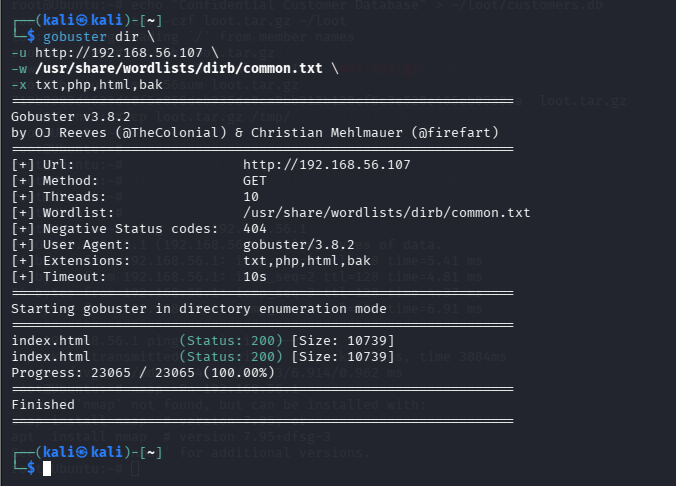

Evidence showing the collection of sensitive files and the
creation of an archive containing data gathered during
post-exploitation.

---

# File System Enumeration

The attacker searched the filesystem to locate directories,
configuration files, and other sensitive information that
could support additional stages of the attack.

### Sensitive File Discovery

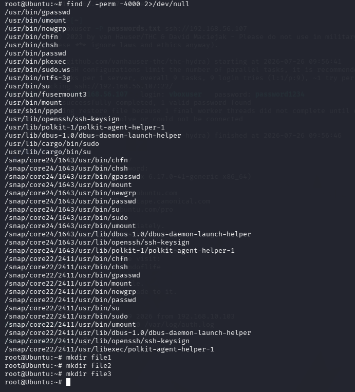

Enumeration of files containing potentially valuable
information on the compromised system.

---

### File System Discovery

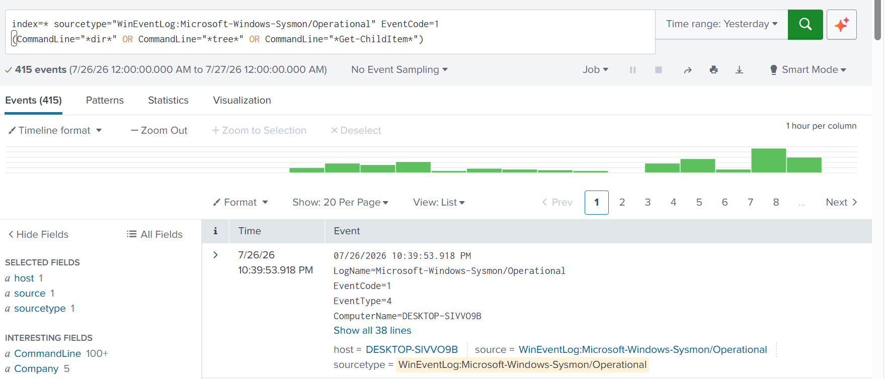

Splunk investigation confirming file and directory
enumeration activity performed by the attacker.

---

# System Enumeration

After identifying valuable files, the attacker collected
information about the operating system, logged-on users, and
network configuration.

### Root System Enumeration

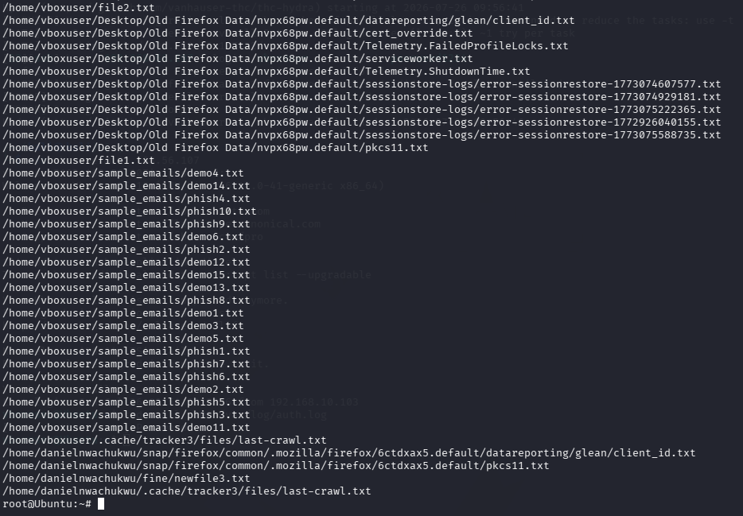

Enumeration of operating system details, privileged accounts,
and system configuration.

---

### Whoami Command Execution

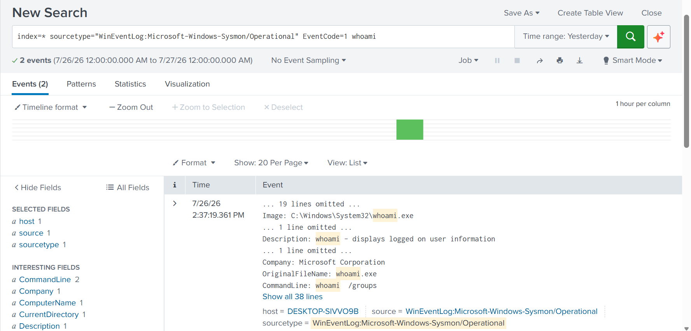

Splunk confirmed execution of the **whoami** command,
allowing analysts to identify the security context under
which the attacker operated.

---

### Network Command Execution

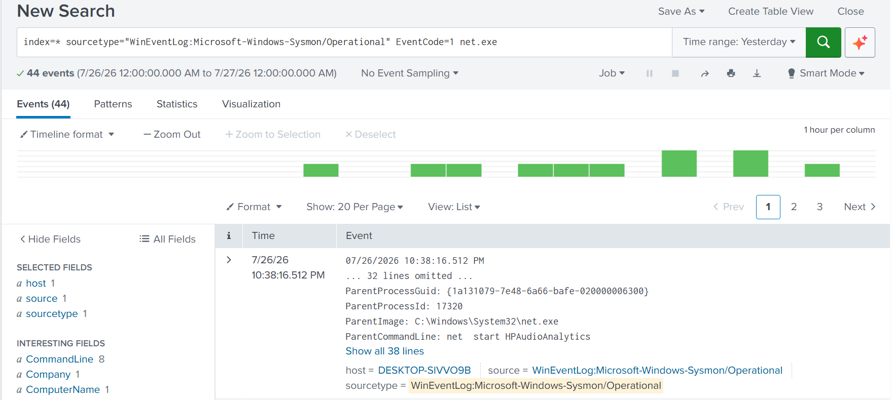

Investigation showing execution of networking commands used
to identify hosts, services, or network configuration.

---

### Network Configuration Discovery

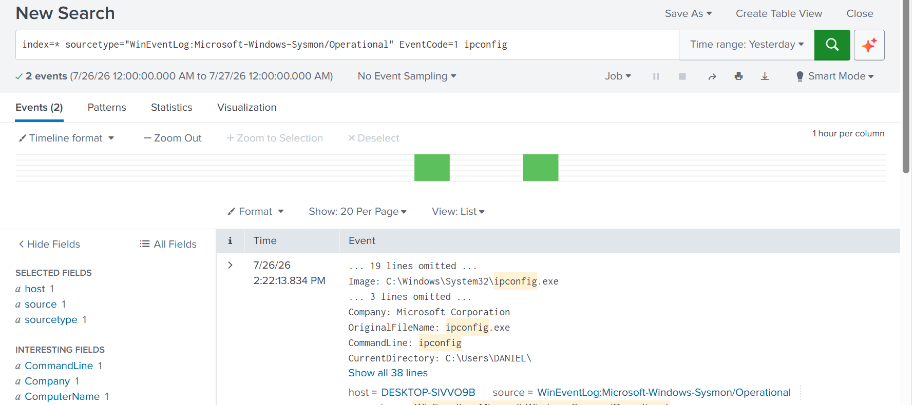

Splunk telemetry confirming that the attacker gathered
network interface and IP configuration information.

---

### Network Connection Investigation

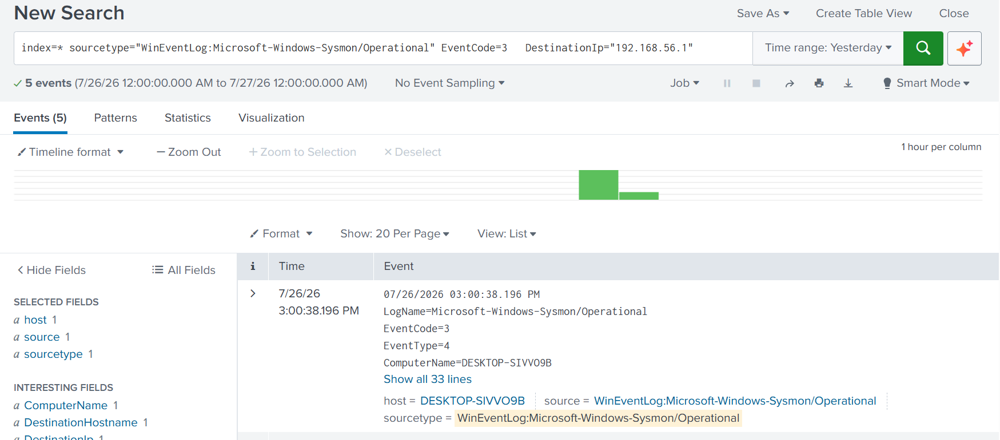

Analysis of network connections involving the laboratory
environment during the discovery phase.

---

### Sysmon Event ID 3 Network Connections

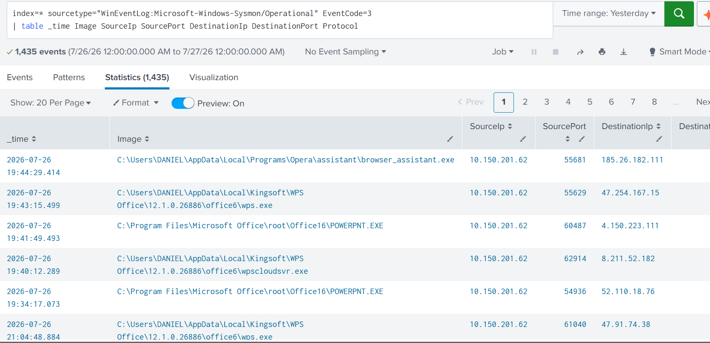

Review of Sysmon Event ID 3 telemetry showing network
connection activity observed during the investigation.

---

### Ubuntu Connectivity Validation

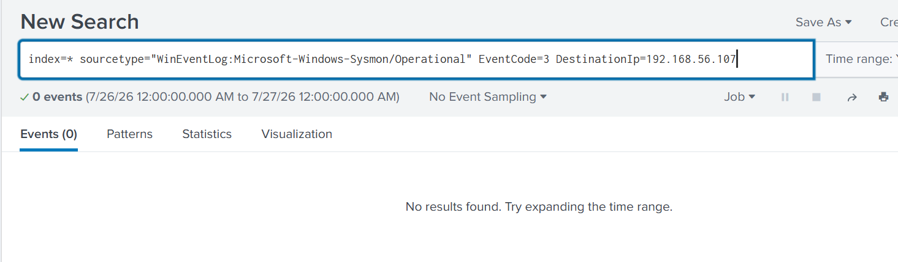

Investigation confirming that no successful communication was
established with the Ubuntu target during this stage.

---

# DNS Investigation

SOC analysts investigated DNS activity to identify domains
resolved by the attacker and correlate network behavior with
the phishing campaign.

### DNS Query Search Results

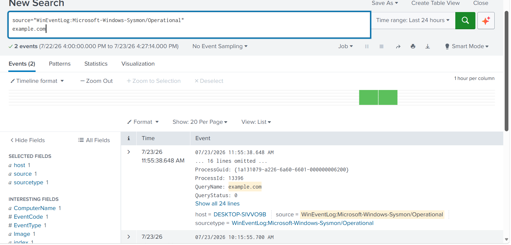

Splunk search results showing DNS queries executed during the
incident.

---

### DNS Query Detection

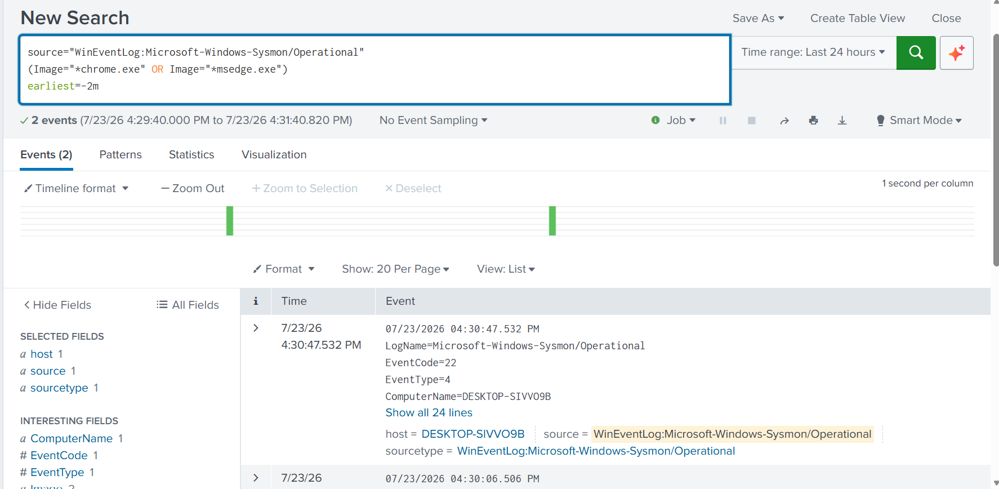

Detection of DNS lookup activity associated with attacker
operations.

---

### Sysmon DNS Event Details

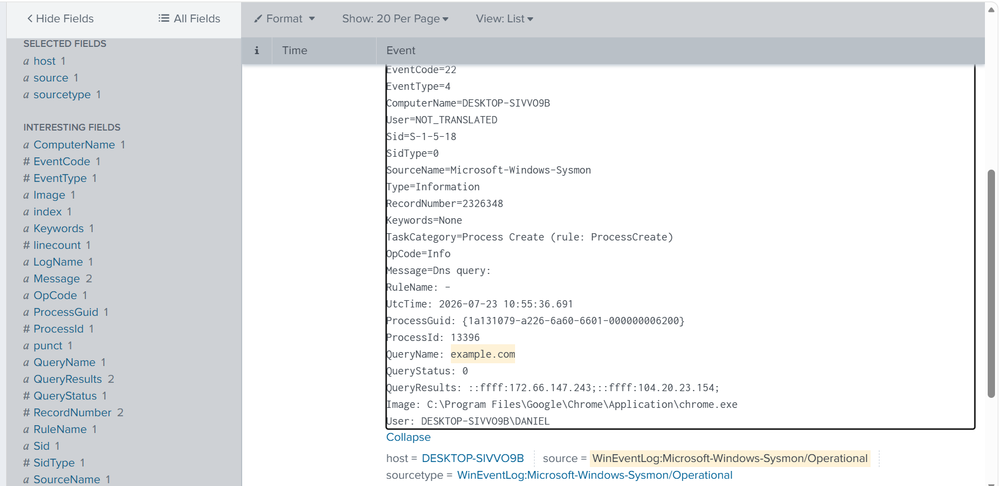

Detailed Sysmon event information for DNS resolution
performed by the compromised endpoint.

---

### DNS Query Statistics

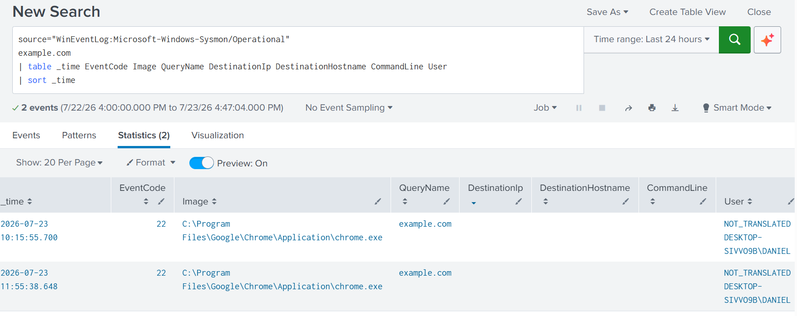

Statistical analysis of DNS requests generated throughout the
investigation.

---

### DNS Resolution Results

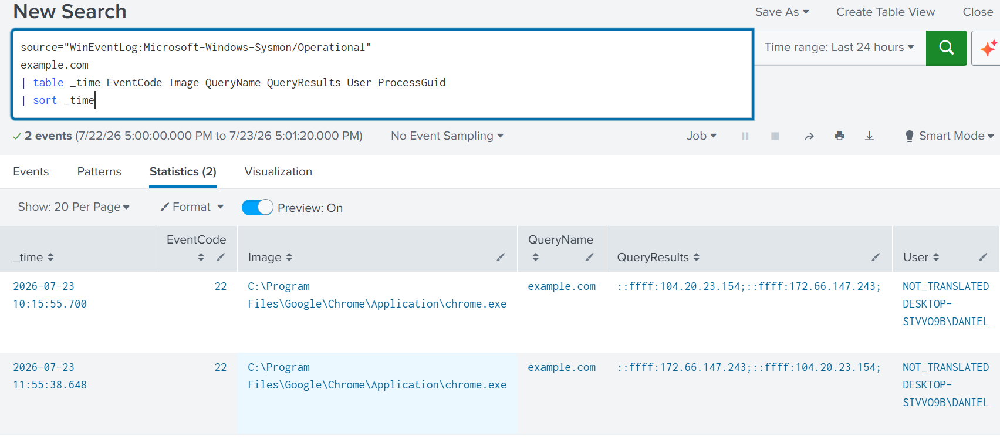

Final DNS resolution results supporting the reconstruction of
attacker activity.

---

# Threat Intelligence Investigation

External threat intelligence platforms were used to enrich
indicators of compromise and validate the reputation of the
identified infrastructure.

### VirusTotal IP Reputation

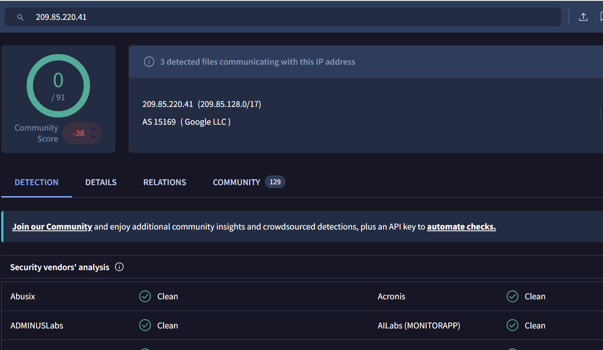

VirusTotal reputation analysis for the investigated IP
address associated with the phishing infrastructure.

---

### VirusTotal Infrastructure Relationships

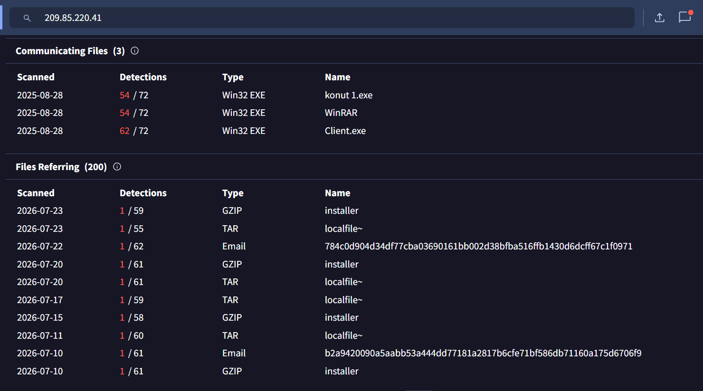

Relationship analysis identifying associated infrastructure
and related indicators within VirusTotal.

---

### WHOIS and Infrastructure Analysis

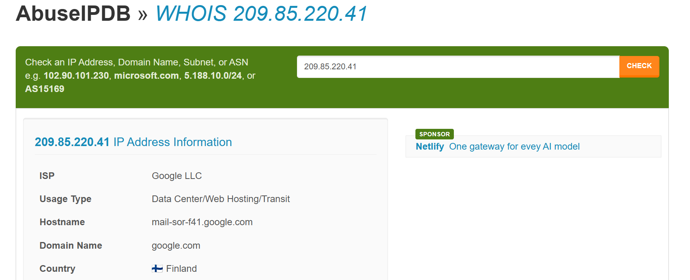

WHOIS investigation providing ownership and infrastructure
details for the identified IP address.

---

### AbuseIPDB Reputation Summary

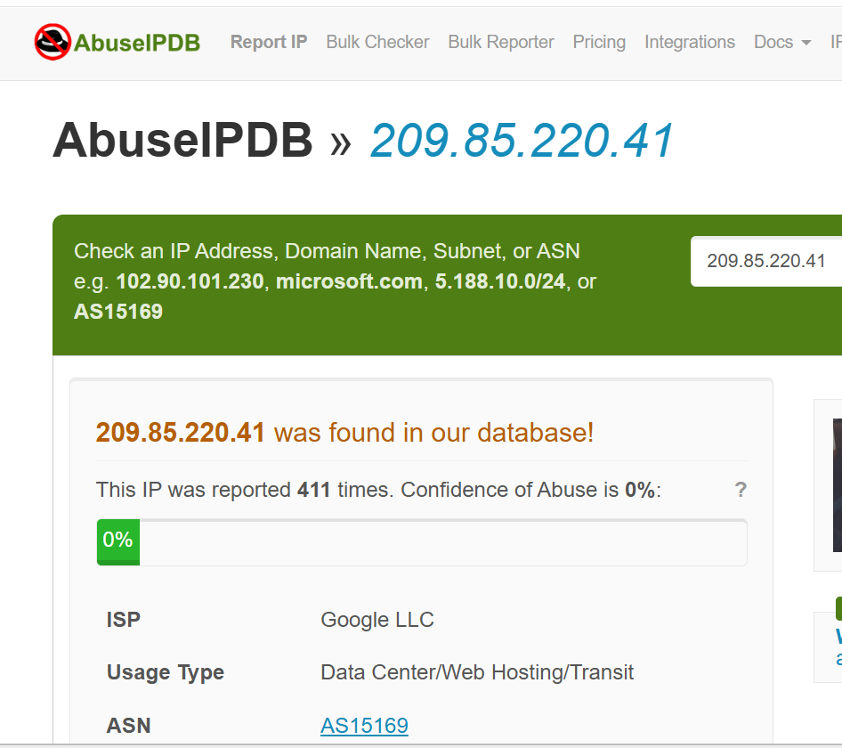

AbuseIPDB reputation assessment summarizing reported
malicious activity linked to the investigated infrastructure.

---

### Historical Abuse Reports

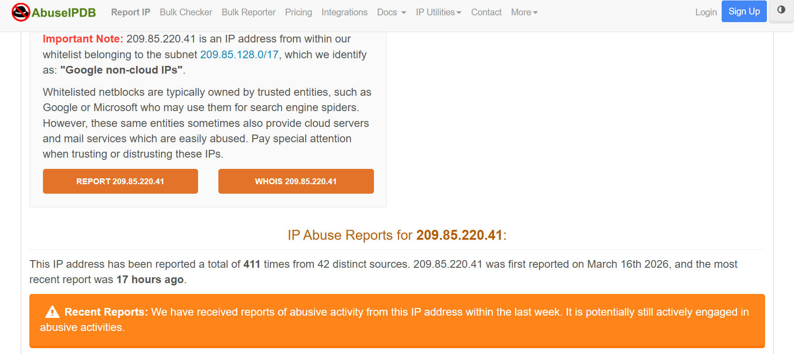

Historical abuse reports providing additional context on
previous malicious activity associated with the identified
IP address.

---

# Findings

The investigation confirmed that the attacker conducted
extensive discovery activities before attempting data
exfiltration.

Evidence demonstrated:

- Collection and archival of sensitive information.
- File and directory enumeration.
- System, user, and network discovery.
- DNS resolution and network investigation.
- External reputation analysis of attacker infrastructure.
- Correlation of discovery activities using Splunk
  Enterprise.

The combination of endpoint telemetry, network monitoring,
and external threat intelligence provided a comprehensive
understanding of the attacker's objectives and the overall
scope of the compromise.

---

# Detection Summary

| Platform | Detection |
|----------|-----------|
| Kali Linux | Sensitive data collected |
| Kali Linux | File system enumeration completed |
| Splunk Enterprise | Discovery commands detected |
| Splunk Enterprise | DNS activity investigated |
| VirusTotal | IP reputation analyzed |
| AbuseIPDB | Infrastructure reputation verified |

---

# Lessons Learned

The Discovery phase demonstrates how attackers gather
critical information before progressing to later stages of an
intrusion.

Monitoring command-line activity, filesystem access, DNS
queries, and network discovery provides valuable insight into
attacker objectives. Combining endpoint telemetry with
trusted threat intelligence enables defenders to identify
high-risk indicators, prioritize incident response actions,
and better understand the scope of a compromise.
