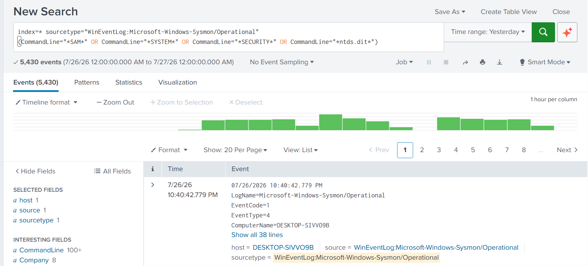
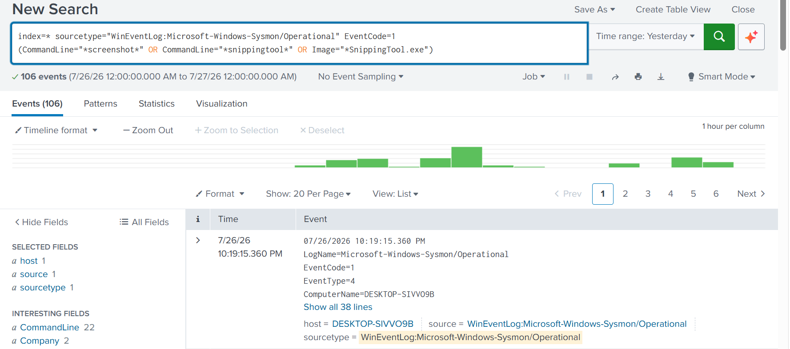

# Collection

## Overview

The Collection phase represents the point at which the
attacker gathered sensitive information from the compromised
system before attempting to transfer it outside the
environment.

During this simulated incident involving the **NAD
Cybersecurity Institute**, the attacker collected
credential-related information and captured sensitive
on-screen data after successfully compromising the Ubuntu
server. The Security Operations Center (SOC) investigated
these activities using Splunk Enterprise to determine whether
valuable information had been staged for exfiltration.

---

# Objectives

- Detect credential-related file access.
- Identify screen capture activity.
- Correlate collection events using Splunk Enterprise.
- Determine the attacker's data collection objectives.
- Prepare evidence for the Exfiltration investigation.

---

# Business Scenario

Following successful exploitation, privilege escalation,
persistence, defense evasion, and internal discovery, the
attacker began collecting valuable information from the
compromised host.

Evidence showed attempts to access credential-related files
and capture sensitive information displayed on the system.
SOC analysts investigated these activities using Splunk to
determine the extent of data collection before any outbound
transfer occurred.

The investigation confirmed that sensitive information had
been staged in preparation for exfiltration.

---

# Tools Used

- Splunk Enterprise
- Sysmon
- Linux Audit Logs
- MITRE ATT&CK Framework

---

# MITRE ATT&CK Mapping

| Tactic | Technique | ID |
|---------|-----------|------|
| Collection | Data from Local System | T1005 |
| Collection | Screen Capture | T1113 |
| Collection | Credentials from Password Stores | T1555 |

---

# Investigation Workflow

1. Investigate credential-related file access.
2. Identify screen capture activity.
3. Correlate process execution with collection events.
4. Validate attacker preparation for data exfiltration.

---

# Evidence

## Credential Collection

The attacker searched for and accessed files containing
credential-related information that could later be used for
unauthorized access or stolen during exfiltration.

### Credential File Access Investigation

Splunk investigation showing access to
credential-related files on the compromised host. This
activity indicates that the attacker was actively gathering
sensitive authentication information as part of the
Collection phase.

---

# Screen Capture Investigation

After collecting credential information, the attacker
captured information displayed on the compromised system to
obtain additional sensitive data that may not have been
stored directly within files.

### Screenshot Capture Investigation

Splunk investigation identifying screen capture activity
performed during the attack. This evidence demonstrates that
the attacker attempted to preserve sensitive visual
information for later retrieval or exfiltration.

---

# Findings

The investigation confirmed that the attacker had progressed
from internal discovery into the Collection phase of the
attack lifecycle.

Evidence demonstrated:

- Access to credential-related files.
- Collection of sensitive local information.
- Screen capture of information displayed on the compromised
  system.
- Preparation of collected information for exfiltration.

These activities significantly increased the risk of
confidential information being exposed outside the
organization.

---

# Detection Summary

| Platform | Detection |
|----------|-----------|
| Splunk Enterprise | Credential file access investigated |
| Splunk Enterprise | Screen capture activity detected |

---

# Lessons Learned

The Collection phase is often the final stage before an
attacker attempts to remove sensitive information from a
compromised environment.

Monitoring access to credential stores, sensitive files, and
screen capture utilities provides defenders with valuable
opportunities to detect malicious activity before data leaves
the organization.

Organizations should implement continuous file access
monitoring, endpoint telemetry, behavioral analytics, and
real-time alerting for suspicious collection techniques to
reduce the likelihood of successful data exfiltration.
