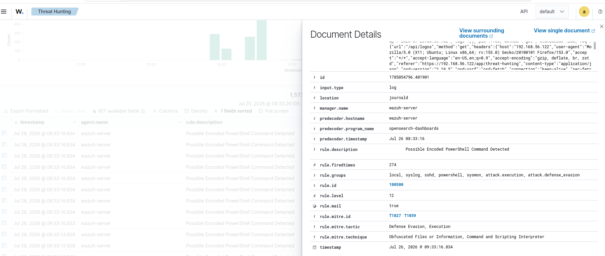
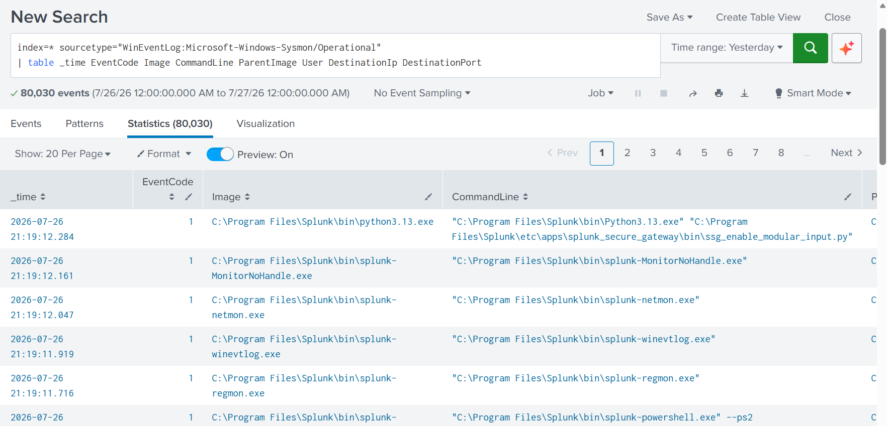
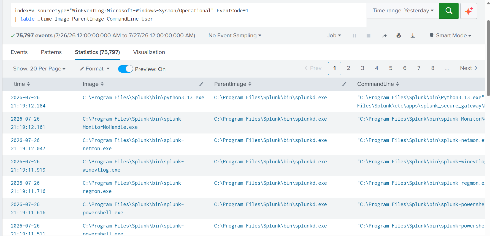
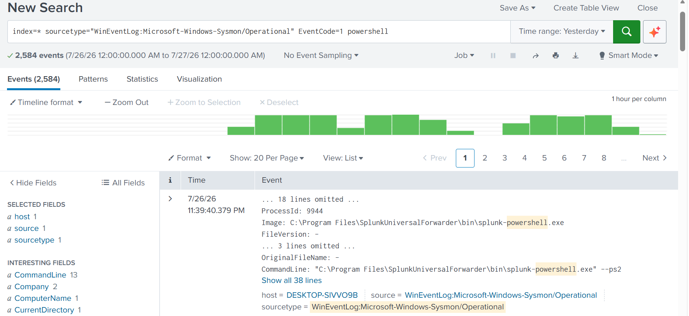
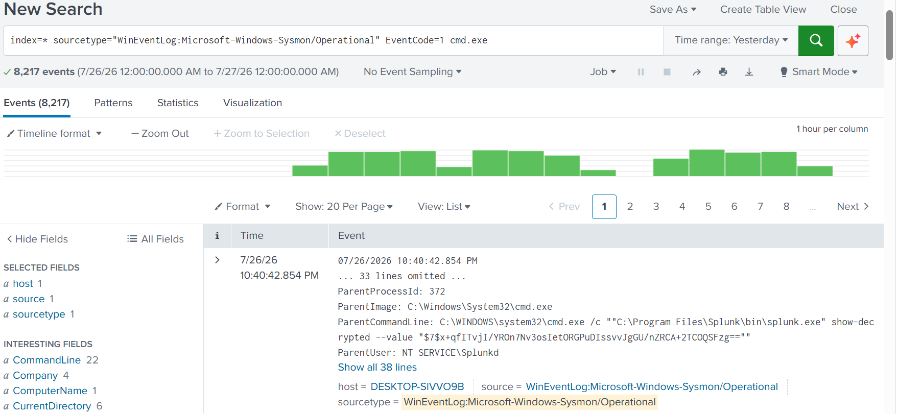
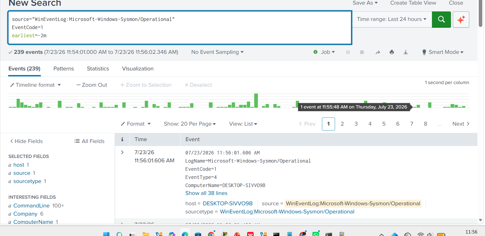
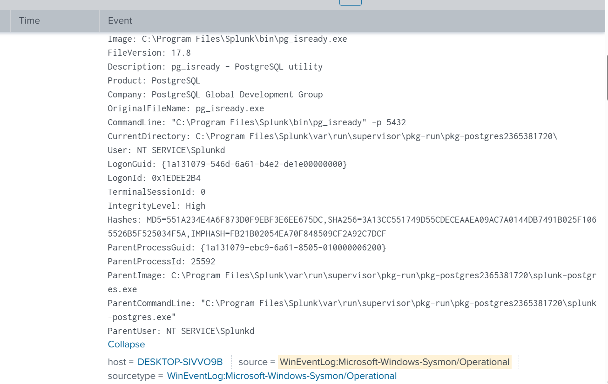

# PowerShell Investigation

## Overview

PowerShell is one of the most commonly abused scripting environments in Windows environments due to its extensive administrative capabilities and native integration with the operating system.

Following the phishing incident at **NAD Cybersecurity Institute**, the Security Operations Center (SOC) performed a dedicated PowerShell threat hunting investigation to identify malicious command execution, encoded commands, suspicious process creation events, and attacker activity captured by Splunk, Sysmon, and Wazuh.

This investigation demonstrates how multiple telemetry sources can be correlated to detect fileless attacks and PowerShell-based adversary techniques.

---

# Objectives

- Detect suspicious PowerShell execution.
- Identify encoded PowerShell commands.
- Investigate command-line arguments.
- Correlate Sysmon process creation events.
- Validate PowerShell activity using Wazuh and Splunk.
- Produce forensic evidence supporting attacker activity.

---

# Investigation Scenario

Throughout the incident, PowerShell was repeatedly leveraged to execute commands, perform reconnaissance, facilitate collection, and simulate data exfiltration.

SOC analysts conducted an in-depth investigation using endpoint telemetry from Sysmon, Windows Event Logs, Wazuh, and Splunk Enterprise to identify suspicious PowerShell execution and reconstruct attacker activity.

The investigation confirmed multiple malicious PowerShell execution indicators across several independent logging sources.

---

# Tools Used

- Splunk Enterprise
- Wazuh SIEM
- Sysmon
- Windows Event Logs
- PowerShell Logging
- MITRE ATT&CK Framework

---

# MITRE ATT&CK Mapping

| Tactic | Technique | ID |
|---------|-----------|------|
| Execution | PowerShell | T1059.001 |
| Defense Evasion | Obfuscated Files or Information | T1027 |
| Discovery | System Information Discovery | T1082 |
| Collection | Data from Local System | T1005 |
| Exfiltration | Exfiltration Over Web Service | T1567 |

---

# Investigation Workflow

1. Review Wazuh PowerShell alerts.
2. Investigate Sysmon Process Creation events.
3. Analyze PowerShell command-line arguments.
4. Correlate Process GUIDs across telemetry sources.
5. Identify encoded PowerShell commands.
6. Validate findings using Splunk searches.
7. Document malicious PowerShell execution.

---

# Evidence

## Wazuh PowerShell Detection

Wazuh generated alerts after detecting suspicious encoded
PowerShell execution on the compromised system. The alert
provided the Security Operations Center (SOC) with the first
indication of potentially malicious PowerShell activity
associated with post-exploitation.

### Wazuh Encoded PowerShell Detection

Wazuh detected the execution of an encoded PowerShell command,
highlighting behavior commonly associated with obfuscation,
malware execution, and defense evasion techniques.

---

# Sysmon Process Creation Investigation

To validate the Wazuh alert, analysts reviewed Sysmon process
creation events collected by Splunk Enterprise. These events
provided detailed visibility into PowerShell execution and
associated command-line activity.

### Sysmon Process Creation Overview

Splunk provided an overview of Sysmon Event ID 1 process
creation events, allowing analysts to identify PowerShell
execution during the investigation.

---

### Process Command-Line Details

Detailed command-line arguments revealed the exact
PowerShell commands executed on the compromised system,
providing valuable forensic evidence for the investigation.

---

### PowerShell Process Detection

Splunk identified suspicious PowerShell process execution,
allowing analysts to correlate encoded commands with attacker
activity observed during previous phases of the intrusion.

---

### Command Process Investigation

Investigation of command execution activity revealed the
relationship between PowerShell and supporting command-line
processes involved in the attack.

---

### Sysmon Process Creation Search

Splunk search results validated Sysmon process creation events
associated with PowerShell execution, enabling investigators
to reconstruct the execution timeline.

---

### Sysmon Event Details

Detailed Sysmon event information provided complete forensic
context, including process identifiers, parent-child process
relationships, command-line arguments, execution timestamps,
and other metadata required to validate the attacker's
PowerShell activity.

- Detailed Sysmon Event ID 1 forensic information for the malicious PowerShell process.

---

# Findings

The investigation confirmed extensive PowerShell activity throughout the intrusion lifecycle.

Observed attacker behavior included:

- Encoded PowerShell execution.
- Suspicious command-line arguments.
- Multiple malicious process creation events.
- Correlation between Wazuh and Splunk detections.
- Sysmon forensic evidence supporting attacker execution.

PowerShell served as one of the primary execution mechanisms during multiple stages of the attack.

---

# Detection Summary

| Platform | Detection |
|----------|-----------|
| Wazuh | Encoded PowerShell Detection |
| Splunk | PowerShell Process Detection |
| Splunk | Process Creation Investigation |
| Sysmon | Event ID 1 Process Creation |
| Windows Event Logs | PowerShell Execution |

---

# Lessons Learned

PowerShell remains one of the most abused administrative tools by modern attackers because it allows native execution without introducing external binaries.

Organizations should enable PowerShell logging, Sysmon process creation monitoring, Script Block Logging, and SIEM correlation rules to rapidly identify malicious PowerShell activity. Combining endpoint telemetry from Wazuh with Splunk analytics significantly improves visibility into fileless attacks and PowerShell-based intrusion techniques.
