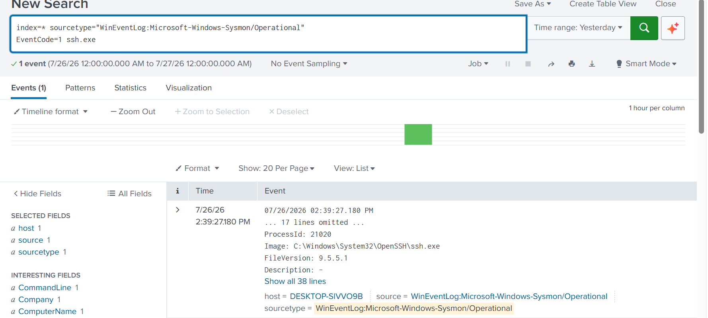
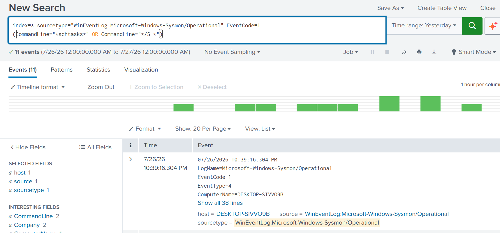
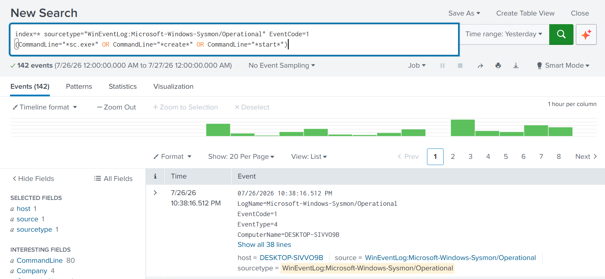

# Lateral Movement

## Overview

The Lateral Movement phase represents the attacker's attempt
to expand access beyond the initially compromised host by
moving to additional systems within the network. After
obtaining a foothold, attackers commonly leverage legitimate
administrative protocols and remote execution techniques to
pivot through an environment while attempting to remain
undetected.

In this simulated **NAD Cybersecurity Institute** incident,
the attacker attempted multiple lateral movement techniques,
including SSH-based remote access, scheduled task execution,
and remote service creation. The Security Operations Center
(SOC) investigated these activities using Splunk Enterprise,
Sysmon, and Windows Event Logs to reconstruct the attacker's
movement across the environment.

---

# Objectives

- Detect SSH-based lateral movement.
- Investigate remote service creation.
- Identify scheduled task execution used for remote movement.
- Correlate process execution with endpoint telemetry.
- Validate attacker pivoting between systems.
- Document evidence supporting lateral movement techniques.

---

# Business Scenario

After compromising the initial host, the attacker attempted
to pivot deeper into the enterprise network using trusted
administrative mechanisms rather than deploying additional
malware.

SOC analysts investigated process creation events, remote
execution activity, and administrative commands using Splunk
Enterprise and endpoint telemetry to determine whether the
attacker attempted to establish access to additional systems
within the NAD Cybersecurity Institute environment.

The investigation confirmed multiple indicators consistent
with lateral movement techniques frequently observed during
enterprise intrusions.

---

# Tools Used

- Splunk Enterprise
- Sysmon
- Windows Event Logs
- SSH
- MITRE ATT&CK Framework

---

# MITRE ATT&CK Mapping

| Tactic | Technique | ID |
|---------|-----------|------|
| Lateral Movement | Remote Services | T1021 |
| Lateral Movement | SSH | T1021.004 |
| Lateral Movement | Scheduled Task | T1053 |
| Execution | Command and Scripting Interpreter | T1059 |

---

# Investigation Workflow

1. Investigate SSH client activity.
2. Analyze scheduled task execution.
3. Review remote service creation events.
4. Correlate process creation telemetry.
5. Validate attempted lateral movement.
6. Document attacker pivoting techniques.

---

# Evidence

## SSH Client Activity

Following the initial compromise, the attacker attempted to
move laterally by initiating SSH connections to additional
systems within the environment. SOC analysts investigated
process creation events to determine whether legitimate
remote administration tools were being abused.

### SSH Client Process Creation

Splunk identified the creation of an SSH client process used
to establish remote connections. This activity indicates an
attempt to access additional hosts using the SSH protocol,
which is commonly abused during lateral movement.

---

## Scheduled Task Investigation

The attacker attempted to execute commands remotely by
leveraging scheduled tasks. This technique enables attackers
to run payloads on remote systems while blending with normal
administrative activity.

### Remote Scheduled Task Detection

Splunk detected activity consistent with remote scheduled
task execution. The investigation confirmed the use of
scheduled tasks as a potential mechanism for executing
commands on additional systems within the environment.

---

## Remote Service Execution

As part of the lateral movement attempt, the attacker also
leveraged remote service creation to facilitate execution on
other hosts. Remote services are frequently abused because
they rely on legitimate Windows administrative functionality.

### Remote Service Creation

Splunk investigation identified activity associated with
remote service creation, providing evidence that the attacker
attempted to move laterally using trusted service management
mechanisms.

The correlation of SSH activity, scheduled task execution,
and remote service creation demonstrates multiple techniques
used to expand access across the environment.

---

# Findings

The investigation confirmed several indicators of lateral
movement following the successful compromise of the initial
host.

Evidence demonstrated:

- SSH client execution for remote access.
- Scheduled task execution used for remote command execution.
- Remote service creation.
- Administrative process execution.
- Attempts to pivot to additional systems within the
  environment.

By correlating endpoint telemetry with process execution
events, SOC analysts reconstructed the attacker's lateral
movement attempts and validated the techniques used during
the intrusion.

---

# Detection Summary

| Platform | Detection |
|----------|-----------|
| Splunk Enterprise | SSH client process creation |
| Splunk Enterprise | Remote scheduled task detected |
| Splunk Enterprise | Remote service creation detected |
| Sysmon | Process creation events |
| Windows Event Logs | Remote administrative activity |

---

# Lessons Learned

The Lateral Movement phase often represents a critical
turning point in an intrusion, allowing attackers to expand
from a single compromised endpoint to multiple systems across
an enterprise network.

Continuous monitoring of SSH activity, remote service
creation, scheduled task execution, and process creation
events enables defenders to identify attacker pivoting at an
early stage. Correlating endpoint telemetry with SIEM
detections provides the visibility required to contain
lateral movement before critical assets are compromised.
